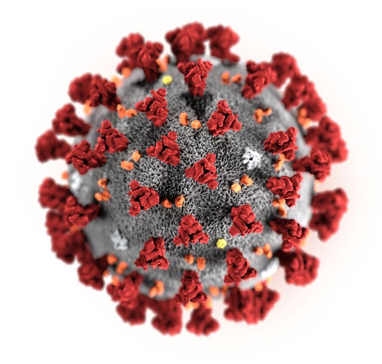
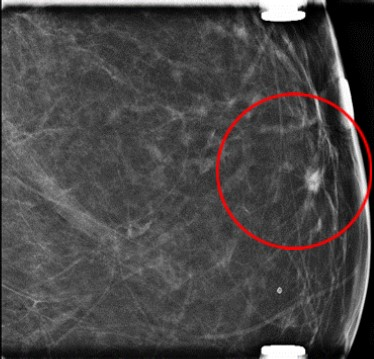
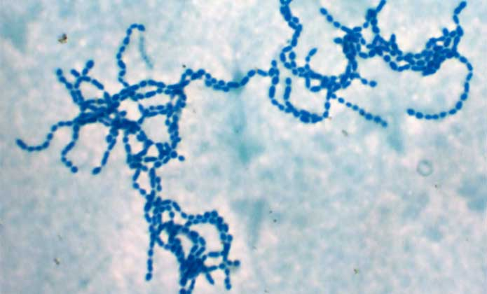
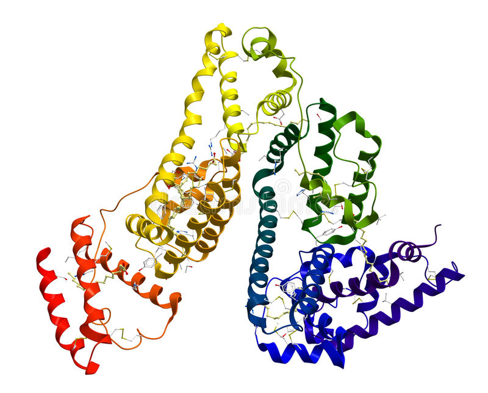

<!-- NOTE PRELIMINAIRE
N'hésitez pas à vous aider des snippets ! 
--> 

```{r setup}
SciViews::R
```

# COVID-19 et groupe sanguin.

 

Des médecins anglais ont essayé de voir si l'on pouvait établir une relation entre le groupe sanguin et l'arrivée sous ventillation mécanique invasive (`vm`) des patients atteints d'une maladie à coronavirus 2019 en unité de soins intensifs. Toutes les données collectées sont rapportées dans le tableau `tab_cov`. Les médecins obtiennent le tableau suivant\ : 

```{r stress_data}
cov_vm <- tibble::tibble(
  groupe = c(rep("A", 666), rep("B", 328), rep("AB", 89), rep("O", 950)),
  vm = c(rep("oui", 466), rep("non", 200),
         rep("oui", 238), rep("non", 90),
         rep("oui", 71), rep("non", 18),
         rep("oui", 663), rep("non", 287)
             ),
  id = 1:length(groupe)
  )

(tab_cov <- table(cov_vm$vm, cov_vm$groupe))
```

Sur base du tableau ci-dessus, répondez aux questions suivantes : 

- Quelle est la probabilité d'être du groupe sanguin AB et sous ventillation mécanique invasive ?

```{r cov1}

```

- Quelle est la probabilité d'avoir un groupe sanguin A ou d'être sous ventillation mécanique invasive ?

```{r cov2}

```

- Quelle est la probabilité d'être sous ventillation mécanique invasive si l'on a un groupe sanguin O ?

```{r cov3}

```

# Diagnostique cancer



Mme X vient de passer une mammographie qui a détecté une anomalie. Sachant que la prévalence du cancer du sein est de 0.1%, que la probabilité d’avoir un résultat positif (anomalie à la mammographie) si l’on a un cancer est de 90% et que dans 15% des cas, le test se trompe pour les personnes saines, **quel est la probabilité que Mme X soit effectivement malade si la mammographie est positive ?**

```{r cancer}

```

# Streptocoque 



Un médecin généraliste voit, au cours d'une semaine, 10 enfants avec une angine. D'après la littérature, chez les enfants souffrants d'une angine, 33 % sont infectés par le *streptocoque bêta hémolytique A* (SBHA). 

- Représentez la table des probabilités pour tous les évènements possibles liés à l'énoncé ci-dessus. 

```{r strepto1}

```

- Quelle est la probabilité que le médecin généraliste voit moins de 4 angines à SBHA ? 

```{r strepto2}

```

- Quelle est la probabilité que le médecin généraliste voit plus de 6 angines à SBHA ?

```{r strepto3}

```

# Albumine 



Des chercheurs ont mesuré la concentration en albumine sérique de 5000 personnes représentatifs de la population belge. Ils concluent que la concentration en albumine sérique est une variable aléatoire qui suit une loi Normale de moyenne 40,1 g/L et d'écart-type de 3,5 g/L. 

- Représentez le graphique de densité de la distribution correspondant à la loi Normale de l'énoncé.

```{r albumine1}

```

- Quelle est la probabilité que la concentration en albumine soit suppérieure à 30 g/L ? 

```{r albumine2}

```

- Quelle est la probabilité que la concentration en albumine soit comprise entre 34 et 46 g/L ?  

```{r albumine3}

```

# Ours


Un écologiste étudie le passage des ours en un point précis d’une rivière séparant un champ d’une forêt des Pyrénées. A l’issue d’un travail rigoureux de plusieurs semaines, il observe en moyenne 4 individus par jour.

- Représentez le graphique de densité de la distribution correspondant à l'énoncé. 

```{r ours1}

```

- Quelle est la probabilité qu'il observe précisément 6 ours par jour ? 

```{r ours2}

```

- Quelle est la probabilité qu'il observe moins de 3 ours par jour ? 

```{r ours3}

```